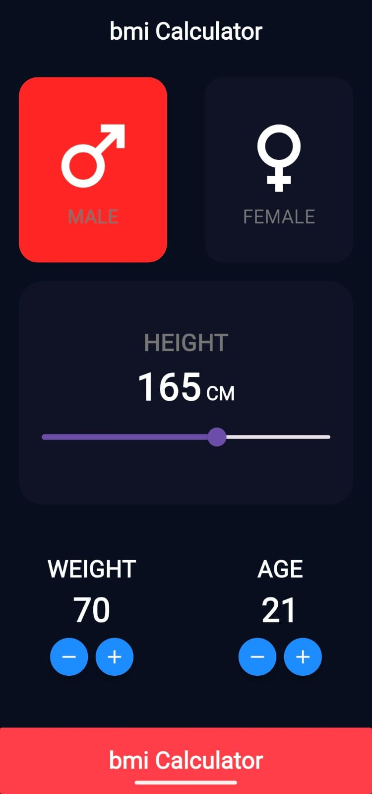
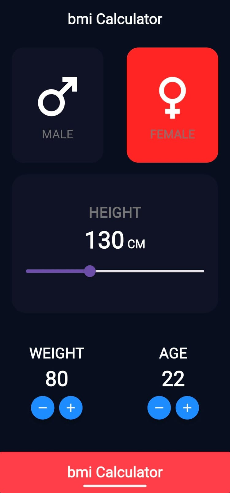

# [bmi_calculator] - Flutter Mobile App

## Description
A Flutter App to Calculate and Represent the measurement of a person's leanness or corpulence based on their height and weight, and is intended to quantify tissue mass. It is widely used as a general indicator of whether a person has a healthy body weight for their height.

## Screen Record
https://github.com/user-attachments/assets/061a1ab0-8ae3-4737-a848-946797b89bf9

A **clean, responsive BMI calculator** built with **Flutter** that lets users select gender, adjust height with a slider, and fine-tune weight & age with +/- buttons. The result is instantly calculated and displayed on a dedicated screen.

---

## 📸 Screenshots  

| Home (Male) | Home (Female) | Result (Male) | Result (Female) |
|-------------|---------------|---------------|-----------------|
|  |  |  |  |

*(All images are stored in the `screenshots/` folder.)*

---

## ✨ Features  

- **Gender toggle** with animated color change  
- **Height slider** (cm) with real-time value display  
- **Weight & Age** controls using **+ / –** buttons  
- **BMI calculation** using the standard formula:  
  `BMI = weight(kg) / (height(m)²)`  
- **Result screen** showing BMI value, gender, and age  
- **Responsive UI** – works on Android & iOS  
- **Clean architecture** with separation of UI & logic  

---

## 🛠️ Technologies & Packages  

| Tech / Package | Purpose |
|----------------|---------|
| **Flutter**    | Cross-platform UI |
| **Dart**       | Core language |
| `flutter_slider`| Height input |

---
