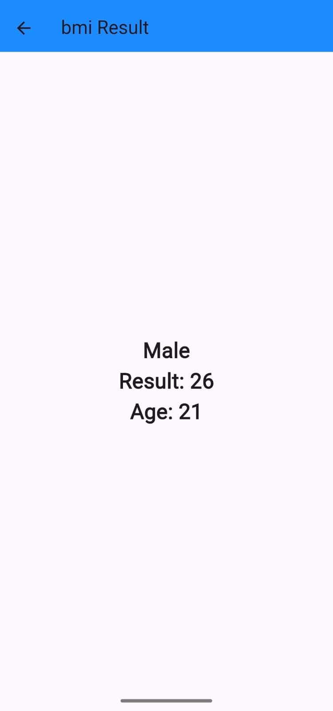

# [bmi_calculator] - Flutter Mobile App

## Description
A Flutter App to Calculate and Represent the measurement of a person's leanness or corpulence based on their height and weight, and is intended to quantify tissue mass. It is widely used as a general indicator of whether a person has a healthy body weight for their height.

## Screen Record
https://github.com/user-attachments/assets/061a1ab0-8ae3-4737-a848-946797b89bf9

A **clean, responsive BMI calculator** built with **Flutter** that lets users select gender, adjust height with a slider, and fine-tune weight & age with +/- buttons. The result is instantly calculated and displayed on a dedicated screen.

---

## 📸 Screenshots  

| Home (Male) | Home (Female) | Result (Male) | Result (Female) |
|-------------|---------------|---------------|-----------------|
|  |  |  |  |

*(All images are stored in the `screenshots/` folder.)*

---

## ✨ Features  

- **Gender toggle** with animated color change  
- **Height slider** (cm) with real-time value display  
- **Weight & Age** controls using **+ / –** buttons  
- **BMI calculation** using the standard formula:  
  `BMI = weight(kg) / (height(m)²)`  
- **Result screen** showing BMI value, gender, and age  
- **Responsive UI** – works on Android & iOS  
- **Clean architecture** with separation of UI & logic  

---

## 🛠️ Technologies & Packages  

| Tech / Package | Purpose |
|----------------|---------|
| **Flutter**    | Cross-platform UI |
| **Dart**       | Core language |
| `flutter_slider`| Height input |

---

## 🎯 What I Learned
- **Implementing interactive sliders and button feedback**
- **Creating reusable custom widgets for a consistent look**
- **Navigating between screens with Navigator.push**
- **Handling unit conversion (cm → m) for accurate BMI math**

## 🎓 Learning Context

 **This app was built while following the https://www.udemy.com/course/complete-flutter-arabic/?couponCode=KEEPLEARNINGOCTA**  
 I completed it as part of my self-paced Flutter learning journey to master:
 - Widget composition & custom UI components
 - State management with `setState`
 - Navigation between screens
 - Responsive layouts using `Expanded`, `Container`, and `Slider`

 **All code is written by me line-by-line** — no copy-paste. I typed, debugged the design (colors, icons, layout tweaks) to reinforce understanding.

**Why share this?**  
Transparency builds trust. This project proves I can **follow structured learning, execute cleanly, and deliver a working app**

## 🔗 Links
> - **APK Download**: See [Releases]
> - **LinkedIn Profile**: https://www.linkedin.com/in/yousif-abdelsalam/

📄 License
MIT License – feel free to fork, modify, and use in your own projects.

- Built by Yousif Abdelsalam – 2nd-year Computer Engineering student @ AIET, Egypt.
- Open to feedback, collaborations, or internship opportunities!
